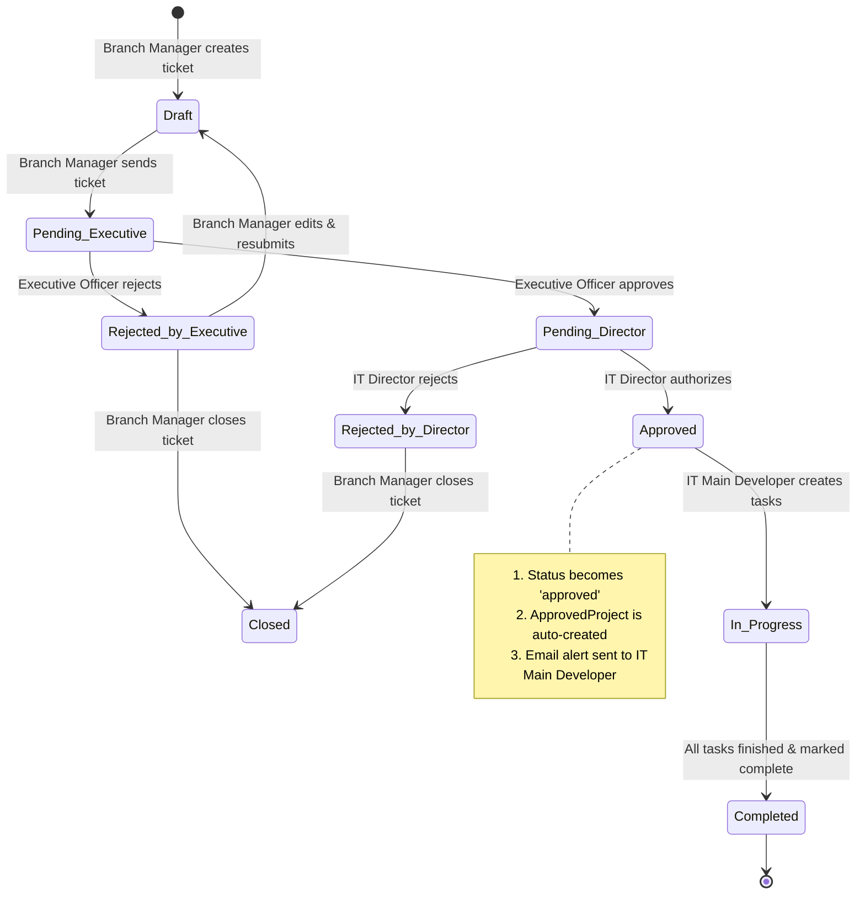
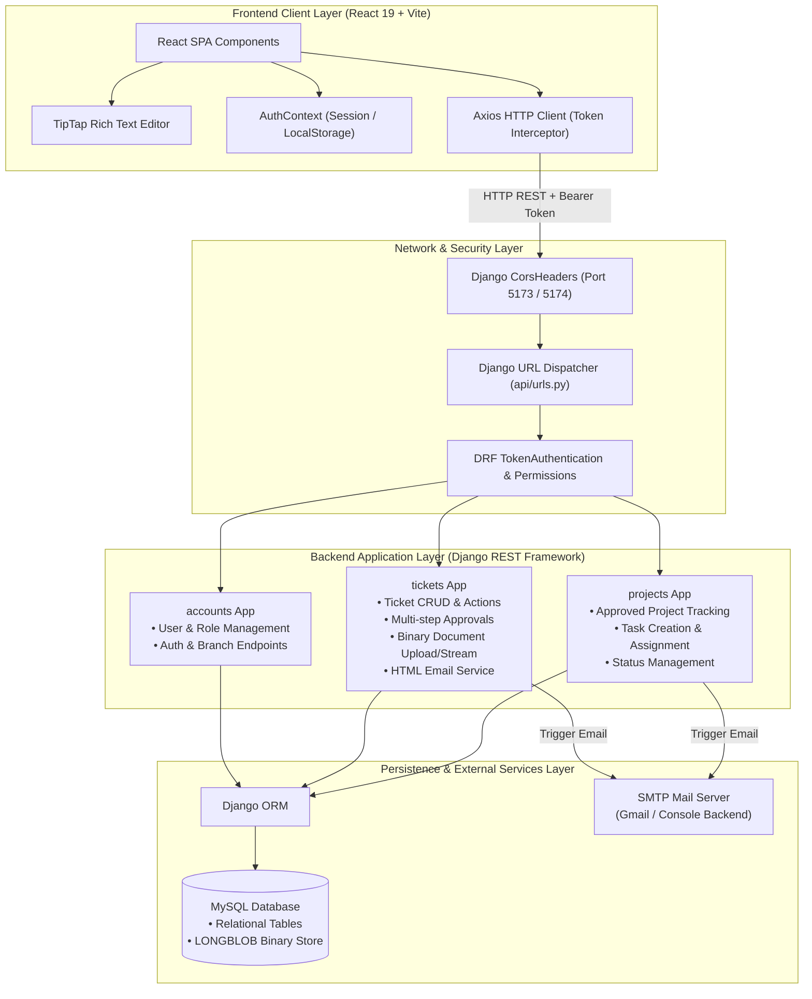
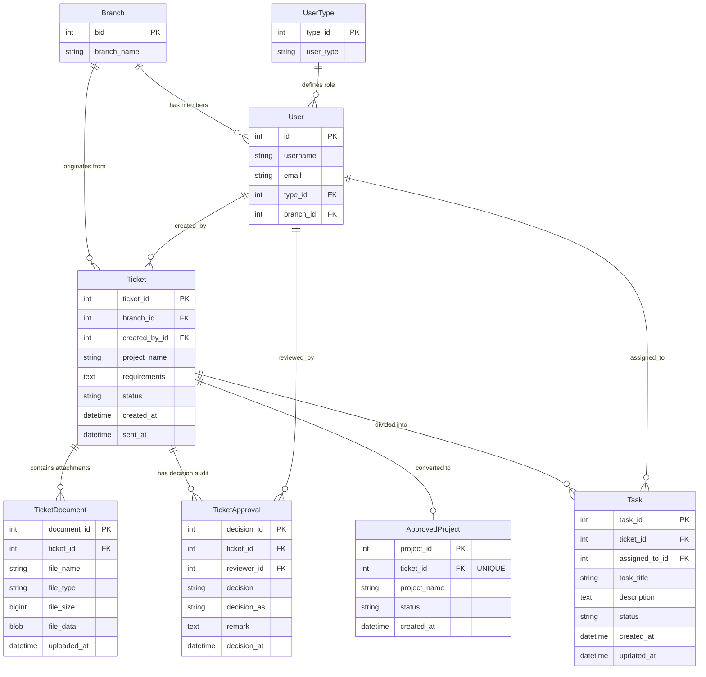

# Software Management System (SMS)

An enterprise-grade **Software Request & Project Lifecycle Management System** built with **Django REST Framework (DRF)** and **React (Vite)**. The system streamlines multi-branch software requests, approval chains, project conversions, task delegation to developers, binary document storage, and automated transactional email alerts.

---

## Table of Contents
1. [System Overview & Key Features](#system-overview--key-features)
2. [Role-Based Access Control (RBAC)](#role-based-access-control-rbac)
3. [Ticket & Project Lifecycle Workflow](#ticket--project-lifecycle-workflow)
4. [System Architecture](#system-architecture)
5. [How Frontend, Backend & Database Connect](#how-frontend-backend--database-connect)
6. [Database Schema & Relationships](#database-schema--relationships)
7. [Directory & File Structure](#directory--file-structure)
8. [API Endpoints Reference](#api-endpoints-reference)
9. [Installation & Setup Guide](#installation--setup-guide)
10. [Environment Variables](#environment-variables)

---

## 1. System Overview & Key Features

Organizations with multiple regional branches frequently need custom internal software tools, modifications, or IT services. This system provides a single governed portal:
- **Centralized Request Intake**: Branch Managers create detailed software requests with rich text specifications (TipTap editor) and direct binary attachments.
- **Two-Tier Governance**: Requests require approval from the branch's **Executive Officer** followed by authorization from the **IT Director**.
- **Automated Project Conversion**: Authorized tickets instantly spawn an **Approved Project** record ready for sprint execution.
- **Task Assignment & Tracking**: The **IT Main Developer** breaks projects down into tasks and assigns them to individual **Developers**.
- **Self-Contained Binary File Storage**: Uploaded files (PDFs, docs, images) are stored directly inside the MySQL database as raw binary blobs (`LONGBLOB`), eliminating disk sync issues across instances.
- **Automated HTML Transactional Alerts**: Notifies IT Main Developers on project authorization and Developers on task assignment using bulletproof responsive HTML email templates.
- **Granular Branch-Isolated Access**: Branch staff see only their branch's data, while IT department personnel and Admins have global operational visibility.

---

## 2. Role-Based Access Control (RBAC)

The platform supports 6 distinct roles:

| Role | Primary Scope | Responsibilities & Capabilities |
| :--- | :--- | :--- |
| **Admin** | System-Wide | Manage branches, create and edit users, view global ticket & project audit logs, access Django Admin. |
| **Branch Manager** | Branch-Specific | Draft software request tickets, attach files, submit tickets to Executive review, close rejected tickets. |
| **Executive Officer** | Branch-Specific | Review submitted branch tickets, read requirements/attachments, add review minutes/remarks, approve (forwards to IT Director) or reject. |
| **IT Director** | Global / Department | Review executive-approved requests, make final executive authorization decision with minute logging; approval auto-initiates an active project and triggers email alert. |
| **IT Main Developer** | Global / Department | Manage authorized projects, break down projects into granular tasks, assign developers, mark projects completed when tasks are done. |
| **Developer** | Assigned Tasks | View personal assigned task queue, update task progress (`Not Started` &rarr; `In Progress` &rarr; `Completed`). |

---

## 3. Ticket & Project Lifecycle Workflow



---

## 4. System Architecture



---

## 5. How Frontend, Backend & Database Connect

### Step-by-Step Request Lifecycle
1. **User Authentication & Token Storage**:
   - User submits username and password via `frontend/src/pages/LoginPage.jsx`.
   - `accounts.views.LoginView` verifies credentials via Django's `authenticate()`.
   - Upon success, DRF returns a unique `Token` key and serialized user role data.
   - Depending on the "Remember Me" toggle, `AuthContext.jsx` saves the token to `localStorage` (persistent) or `sessionStorage` (tab lifetime).
2. **Authenticated API Calls**:
   - Every outbound request via `frontend/src/services/api.js` is automatically intercepted:
     ```javascript
     API.interceptors.request.use((config) => {
       const token = localStorage.getItem('token') || sessionStorage.getItem('token');
       if (token) config.headers.Authorization = `Token ${token}`;
       return config;
     });
     ```
3. **Backend Route & Permission Resolution**:
   - Request hits `config/urls.py` &rarr; routed to `api/urls.py` &rarr; forwarded to respective app (`accounts.urls`, `tickets.urls`, `projects.urls`).
   - DRF evaluates `TokenAuthentication` and runs `get_queryset()` filtering:
     - Branch Managers only query records where `branch = request.user.branch`.
     - Executive Officers only see reviewable tickets of their branch.
     - IT Directors only see tickets past executive approval.
     - Developers only see tasks assigned to their user ID.
4. **Binary Document Uploads**:
   - When files are attached in `BMCreateTicketPage.jsx`, they are transmitted as `multipart/form-data`.
   - `TicketViewSet.upload_document` reads the raw file bytes in memory (`uploaded_file.read()`) and writes them directly into the `file_data` field (`BinaryField` &rarr; MySQL `LONGBLOB`).
   - When viewing or downloading documents, `TicketViewSet.download_document` serves the binary bytes with appropriate MIME headers directly from the database—no files are saved to the server's local file system.
5. **Database Interaction & Transactions**:
   - Django ORM executes parameterized SQL queries against MySQL (`software_management_db`).
6. **Automated Event Notifications**:
   - When IT Director approves: `send_ticket_approved_to_it_main()` sends HTML email to all users with `IT Main Developer` role.
   - When IT Main Developer assigns a task: `send_task_assigned_to_developer()` sends task briefs to the assigned developer's email.

---

## 6. Database Schema & Relationships



---

## 7. Directory & File Structure

```
software-management/
├── config/                     # Django Project Orchestration
│   ├── __init__.py
│   ├── asgi.py
│   ├── settings.py             # Settings: DB, CORS, Auth, Apps, Email, Static/Media
│   ├── urls.py                 # Top-level URL routing (/admin/, /api/)
│   └── wsgi.py
│
├── accounts/                   # User, Branch & Role Management App
│   ├── models.py               # Custom User, Branch, UserType models
│   ├── views.py                # Login, Logout, Current User, Branch & User Management
│   ├── serializers.py          # Serializers for User, Branch, Roles
│   ├── permissions.py          # Custom DRF permission classes
│   ├── urls.py                 # /api/auth/* routes
│   └── admin.py                # Admin configuration for user models
│
├── tickets/                    # Core Ticket & Document Management App
│   ├── models.py               # Ticket, TicketDocument (Binary), TicketApproval
│   ├── views.py                # TicketViewSet (send, close, upload_document, decisions)
│   ├── serializers.py          # Serializers for Ticket, Document, Decision inputs
│   ├── emails.py               # Responsive HTML email dispatchers
│   ├── urls.py                 # /api/tickets/* routes
│   └── admin.py
│
├── projects/                   # Development Projects & Tasks App
│   ├── models.py               # ApprovedProject, Task models
│   ├── views.py                # ApprovedProjectViewSet, TaskViewSet
│   ├── serializers.py          # Serializers for Projects and Tasks
│   ├── urls.py                 # /api/projects/* routes
│   └── admin.py
│
├── api/                        # Central API Hub
│   ├── urls.py                 # Combines auth, tickets, and projects routers
│   └── views.py                # Heartbeat and utility views
│
├── frontend/                   # React Single Page Application (Vite)
│   ├── index.html              # App entry HTML template
│   ├── vite.config.js          # Vite build and dev server config
│   ├── package.json            # Frontend npm dependencies
│   ├── src/
│   │   ├── main.jsx            # React root mount point
│   │   ├── App.jsx             # Top-level router and AuthProvider wrapper
│   │   ├── App.css / index.css # Global styling and theme tokens
│   │   │
│   │   ├── context/
│   │   │   └── AuthContext.jsx # Auth state, login/logout, session expiry handling
│   │   │
│   │   ├── services/
│   │   │   └── api.js          # Axios client with baseURL and auth token interceptor
│   │   │
│   │   ├── components/
│   │   │   ├── MainLayout.jsx  # Dynamic role-based navigation sidebar & header
│   │   │   ├── MainLayout.css  # Responsive drawer & layout styling
│   │   │   ├── ProfileMenu.jsx # User profile avatar & dropdown
│   │   │   ├── RichTextEditor.jsx # TipTap WYSIWYG editor with table/link support
│   │   │   ├── DeveloperDashboard.jsx      # Task tracking for developers
│   │   │   └── ITMainDeveloperDashboard.jsx # Project breakdown & task assigner
│   │   │
│   │   └── pages/
│   │       ├── LoginPage.jsx               # Universal auth portal
│   │       ├── ExecutiveOfficerDashboard.jsx # Executive review & decision workspace
│   │       ├── branch-manager/             # Branch Manager workflows
│   │       │   ├── DashboardPage.jsx       # Branch ticket metrics & overview
│   │       │   ├── CreateTicketPage.jsx    # Ticket creator with attachments
│   │       │   └── ViewTicketsPage.jsx     # Detailed ticket list & edit modal
│   │       ├── it-director/                # IT Director workspace
│   │       │   └── DashboardPage.jsx       # Final approval and review workspace
│   │       └── admin/                      # System administrator pages
│   │           ├── AdminDashboard.jsx      # System-wide metrics & charts
│   │           ├── AdminUsersPage.jsx      # User creation & role management
│   │           ├── AdminBranchesPage.jsx   # Branch registration & configuration
│   │           ├── AdminTicketsPage.jsx    # Global ticket ledger
│   │           └── AdminProjectsPage.jsx   # Global project and task monitor
│
├── manage.py                   # Django CLI entrypoint
├── requirements.txt            # Python backend dependencies
├── .env.example                # Example environment variables template
└── README.md                   # System documentation
```

---

## 8. API Endpoints Reference

### Authentication & Users (`/api/auth/`)
| Method | Endpoint | Description | Permitted Roles |
| :--- | :--- | :--- | :--- |
| `POST` | `/api/auth/login/` | Authenticate user; returns auth token & user object | Public |
| `POST` | `/api/auth/logout/` | Invalidate current auth token | Authenticated |
| `GET` | `/api/auth/me/` | Fetch authenticated user's profile and branch info | Authenticated |
| `GET/POST`| `/api/auth/branches/` | List all branches / Create new branch | Authenticated (POST: Admin) |
| `GET` | `/api/auth/roles/` | List user role types | Authenticated |
| `GET` | `/api/auth/developers/`| List all users with `Developer` role | Authenticated |
| `GET/POST`| `/api/auth/users/` | List users / Register new user | Admin |
| `GET/PUT/PATCH/DELETE` | `/api/auth/users/<id>/` | View, update, or deactivate user | Admin |

### Tickets & Approvals (`/api/tickets/`)
| Method | Endpoint | Description | Permitted Roles |
| :--- | :--- | :--- | :--- |
| `GET/POST`| `/api/tickets/` | List tickets (filtered by role) / Create draft ticket | Branch Manager, Admin |
| `GET/PUT/PATCH` | `/api/tickets/<id>/` | View or update ticket details | Ticket Creator, EO, Admin |
| `POST` | `/api/tickets/<id>/send/` | Submit ticket for Executive review | Branch Manager, Creator |
| `POST` | `/api/tickets/<id>/close/` | Close draft or rejected ticket | Branch Manager, Creator |
| `POST` | `/api/tickets/<id>/upload-document/` | Upload document directly to MySQL blob | Ticket Creator |
| `GET` | `/api/tickets/documents/<doc_id>/download/` | Stream binary document directly from DB | Authenticated |
| `POST` | `/api/tickets/<id>/executive-decision/` | Executive Officer approves/rejects ticket | Executive Officer |
| `POST` | `/api/tickets/<id>/director-decision/` | IT Director authorizes/rejects proposal | IT Director |

### Projects & Tasks (`/api/projects/`)
| Method | Endpoint | Description | Permitted Roles |
| :--- | :--- | :--- | :--- |
| `GET` | `/api/projects/` | List authorized development projects | Authenticated |
| `POST` | `/api/projects/<id>/mark-completed/` | Mark project and original ticket completed | IT Main Dev, IT Director |
| `GET/POST`| `/api/projects/tasks/` | List tasks (filtered by dev) / Create new task | IT Main Dev, Admin |
| `GET/PUT/PATCH` | `/api/projects/tasks/<id>/` | Edit task assignment or details | IT Main Dev, Admin |
| `PATCH`| `/api/projects/tasks/<id>/update-status/` | Update task status (`Not Started`, `In Progress`, `Completed`) | Assigned Developer |

---

## 9. Installation & Setup Guide

### Prerequisites
- **Python**: 3.10+
- **Node.js**: 18.0+ & `npm`
- **Database**: MySQL Server (or MariaDB / SQLite)

### Backend Setup
1. **Navigate to the repository root**:
   ```bash
   cd software-management-
   ```
2. **Create and activate virtual environment**:
   ```bash
   python3 -m venv venv
   source venv/bin/activate    # On Windows: venv\Scripts\activate
   ```
3. **Install Python dependencies**:
   ```bash
   pip install -r requirements.txt
   ```
4. **Configure `.env`**:
   Copy `.env.example` to `.env` and fill in your database credentials:
   ```bash
   cp .env.example .env
   ```
5. **Run database migrations**:
   ```bash
   python manage.py makemigrations
   python manage.py migrate
   ```
6. **Create a superuser (optional)**:
   ```bash
   python manage.py createsuperuser
   ```
7. **Start the Django development server**:
   ```bash
   python manage.py runserver
   ```
   *Backend runs on `http://127.0.0.1:8000/`.*

### Frontend Setup
1. **Navigate to the frontend directory**:
   ```bash
   cd frontend
   ```
2. **Install frontend dependencies**:
   ```bash
   npm install
   ```
3. **Start the Vite development server**:
   ```bash
   npm run dev
   ```
   *Frontend opens on `http://localhost:5173/`.*

---

## 10. Environment Variables

Create a `.env` file in the root directory:

```ini
# Django Core Settings
SECRET_KEY=django-insecure-your-secret-key-here
DEBUG=True

# Database Configuration (MySQL)
DB_ENGINE=django.db.backends.mysql
DB_NAME=software_management_db
DB_USER=root
DB_PASSWORD=your_mysql_password
DB_HOST=127.0.0.1
DB_PORT=3306

# Email Configuration (SMTP)
EMAIL_BACKEND=django.core.mail.backends.smtp.EmailBackend
EMAIL_HOST=smtp.gmail.com
EMAIL_PORT=587
EMAIL_USE_TLS=True
EMAIL_HOST_USER=your_company_email@gmail.com
EMAIL_HOST_PASSWORD=your_app_password
DEFAULT_FROM_EMAIL=no-reply@company.com
```

In `frontend/.env`:
```ini
VITE_API_BASE_URL=http://127.0.0.1:8000/api/
```
